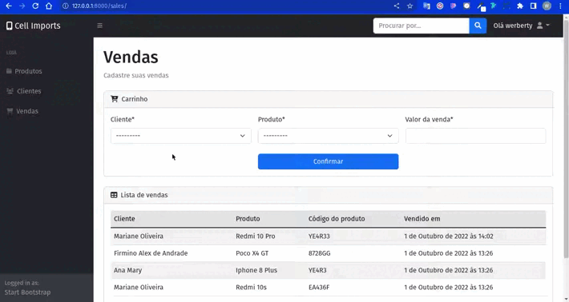

<h1 align="center">
    📱 Cell Imports
</h1>

🖥️ Um sistema administrativo para uma loja de smartphones

 <a href="#objetivo">Objetivo</a> •
 <a href="#funcionalidades">Funionalidades</a> • 
 <a href="#layout">Layout</a> • 
 <a href="#tecnologias">Tecnologias</a> • 

<h4 align="center"> 
	🚧  Em construção...  🚧
</h4>

<h2 id="objetivo">📝 Objetivo</h2>

Um sistema capaz de gerenciar stock de produtos, cadastro de clientes vendas. Em que pode ter acesso à geração de nota fiscal e dados detalhados das vendas da loja.

<h2 id="funcionalidades">⚙️ Funcionalidades</h2>

- [x] Cadastro de produtos
- [x] Deletar produtos
- [x] Editar produtos
- [x] listar produtos cadastrados
- [x] Cadastro de clientes
- [x] Cadastro de vendas
- [x] Detalhes sobre produto, cliente e vendas
- [x] Gerar nota de fisca da venda
- [ ] Fazer controle de garatia dos produtos

<h2 id="layout">🖼️ Layout</h2>

<h1 align="center">
  
  
</h1>

<h2 id="tecnologias">🛠 Tecnologias</h2>

As seguintes ferramentas foram usadas na construção do projeto:

- [Python](https://www.python.org/)
- [Django](https://www.djangoproject.com/start/overview/)
- [HTML5](https://developer.mozilla.org/pt-BR/docs/Web/HTML)
- [CSS3](https://developer.mozilla.org/pt-BR/docs/Web/CSS)
- [Bootstrap](https://getbootstrap.com/)
- [jquery](https://jquery.com/)
